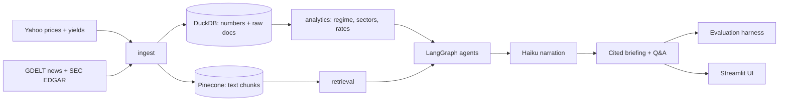
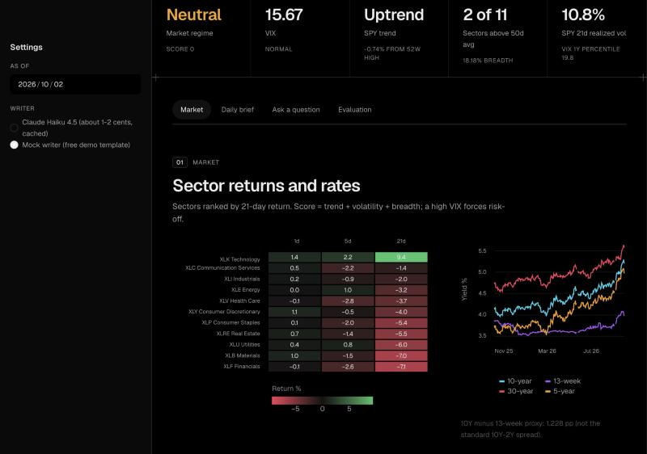
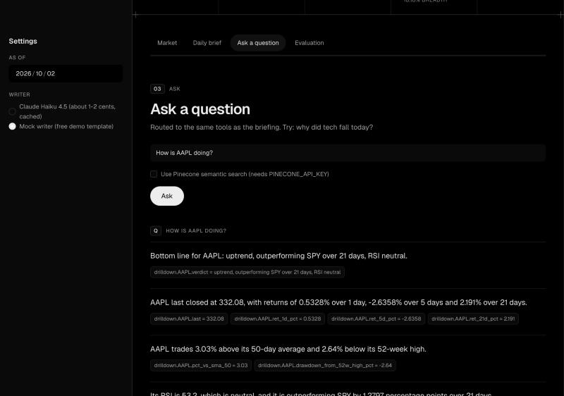

# AI Market Intelligence Platform

Answers "what's happening in the market and why?" by combining prices, macro data, news, and SEC filings into an **auditable, cited daily briefing** plus a Q&A interface.

The core design rule: **all numbers are computed in code** (DuckDB + pandas). The LLM (Claude Haiku 4.5) only narrates structured data and cites sources; it never does arithmetic. Every claim carries a source ID that traces back to a data field or a document URL.

## Architecture



## Phase status
- [x] Phase 0: scaffolding and agent context files
- [x] Phase 1: price and yield ingestion and regime analytics
- [x] Phase 2: news + SEC filings ingestion and Pinecone retrieval (code and offline tests done; live run needs your keys)
- [x] Phase 3: LangGraph agents (daily briefing + Q&A); verified with the mock writer, real Haiku run is yours to try
- [x] Phase 4: evaluation harness
- [x] Phase 5: Streamlit app and final README

## Quick start (macOS, zsh)
Run everything from the project root (`ai-market-intelligence/`).

```bash
python3 -m venv .venv
source .venv/bin/activate
pip install -r requirements.txt
cp .env.example .env        # fill in keys later; Phase 1 needs none
pytest
PYTHONPATH=src python -m market_intel.scripts.run_phase1
```

Add `--skip-ingest` to reuse data already in DuckDB, or `--as-of 2025-06-30` to replay a past date.

## How to test this app, and what it actually does

### What it does, in plain terms
Each day's workflow, end to end:
1. **Ingest** free data into a local DuckDB file: prices and Treasury yields (Yahoo), SEC filings (EDGAR), news headlines (GDELT).
2. **Compute** every number in code: sector returns, VIX regime, SPY trend, breadth, yields, and per-stock technicals (RSI, moving averages, drawdown).
3. **Retrieve** recent filings and headlines (Pinecone semantic search for questions, or the latest stored documents).
4. **Narrate**: Claude Haiku 4.5 receives only those numbers and excerpts, and writes short claims. Each claim must list its sources: a data path like `regime.vol_regime.vix_level`, or a document ID that links to the filing or article.
5. **Validate**: any claim whose source does not exist is dropped before you see it.
6. **Evaluate**: a separate harness recomputes every number from DuckDB and checks each claim's numbers against the sources it cites.

What it does **not** do: give investment advice, predict prices, calculate anything in the LLM, or use data outside the sources in the provenance table.

### 1. Automated tests (offline, free, about 5 seconds)
```bash
source .venv/bin/activate
pytest
```
59 tests, no network, no API keys, no real database (synthetic data and an in-memory DuckDB):

| File | Tests | Checks |
|---|---|---|
| `test_analytics.py` | 19 | regime maths, VIX thresholds, sector sorting, risk-off on high VIX, upsert idempotency, no look-ahead in loaders |
| `test_text.py` | 14 | chunking, deterministic vector IDs, junk-headline filter, EDGAR/GDELT parsing, Pinecone batching and filters (mocked) |
| `test_agents.py` | 12 | the LangGraph flow, tool routing, citation validator, prompt-injection boxing, Haiku cache and cost maths |
| `test_eval.py` | 11 | planted wrong numbers are caught, tolerance, thresholds, question routing |
| `test_app.py` | 3 | the Streamlit app renders, generates a cited brief, and answers a question |

### 2. Try the app (about 5 minutes, free)
Run `PYTHONPATH=src streamlit run src/market_intel/app/streamlit_app.py` and open the URL it prints. Needs the database from Phase 1 (`run_phase1`).

| Step | What you should see |
|---|---|
| Page loads | Regime, VIX, SPY trend, breadth and realized-vol tiles, with a "Data as of" date |
| **Market** tab | A sector heatmap ranked by 21-day return, and a 1-year chart of the 13-week, 5-year, 10-year and 30-year yields |
| **Daily brief** tab, click *Generate briefing* (Mock writer) | Six sections. Data citations appear as `path = value`; filings and headlines are clickable links. "Citation check: N of N claims kept." |
| **Ask a question**, try *why did tech fall today?* | An expandable "Tools run" log (sectors, regime, documents) and a cited answer |
| Ask *How is AAPL doing?* | The drill-down tool runs and AAPL technicals appear in the answer |
| Change **As of** in the sidebar | Every number recomputes using only data up to that date |
| **Evaluation** tab | The saved results: numeric match rate, unsupported claims, citation coverage, tool routing |

The mock writer reads literally (for example "regime.score is 0") because it copies facts verbatim. It exists so you can test the whole pipeline for free. Choose **Claude Haiku 4.5** in the sidebar (shown only if `ANTHROPIC_API_KEY` is set) for natural prose; one briefing costs about 1.6 cents and repeats are free from the cache.

### 3. Command-line checks
```bash
PYTHONPATH=src python -m market_intel.scripts.run_briefing --dry-run
PYTHONPATH=src python -m market_intel.scripts.ask "why did tech fall today?" --dry-run --no-search
PYTHONPATH=src python -m market_intel.scripts.run_eval --dry-run
```
Each prints which tools ran, the cited result, a validation line (`claims_dropped` should be 0 for the mock writer), and LLM usage (`cost_usd: 0.0`). The eval dry run proves the harness works; it does not measure model quality, because the mock copies numbers exactly.

### 4. Real-model check (about 5 cents)
```bash
PYTHONPATH=src python -m market_intel.scripts.run_eval --run-questions
```
This is the meaningful test. It writes a real briefing, answers the 10 fixed questions, and checks every number against DuckDB. Exit code 0 means numeric accuracy met the 0.95 threshold; 1 means it did not. The report is saved to `eval_reports/latest.json`.

### What a problem looks like
| Symptom | Likely cause |
|---|---|
| "No database found" in the app | Run `run_phase1` first |
| Fewer headlines than expected, or GDELT warnings | GDELT throttles; wait 20-30 minutes and re-run (filings are unaffected) |
| Claims dropped in "Citation check" | The writer cited a source that does not exist; the validator removed it, which is correct |
| Eval exits 1 | A number in a claim did not match its cited source; the report lists each unmatched number |
| Briefing says "No briefing was produced" | The model output was not valid JSON. A truncated answer is never cached, so re-running retries; other bad output is cached by input, so change the prompt or data before retrying |

## Data provenance
| Source | Used for | Terms followed |
|---|---|---|
| Yahoo Finance via `yfinance` | ETF/benchmark prices, VIX, Treasury yield tickers | Unofficial; personal/research use. Raw data stays in a local, git-ignored DuckDB and is never republished. |
| SEC EDGAR | 8-K, 10-Q, 10-K filings (Phase 2) | Declared User-Agent, max 10 requests/second |
| GDELT | News headlines, URLs, dates (Phase 2) | Cites the [GDELT Project](https://www.gdeltproject.org/); titles and URLs only, no article text |
| Treasury FiscalData | Treasury statistics, if needed | Open API, no key; data free to use without restriction |

Deliberately **not** used: FRED (dropped to keep to unambiguous sources) and ICE credit-spread data (reproduction is restricted).

## Phase 2: text ingestion and retrieval
```bash
# needs SEC_USER_AGENT and PINECONE_API_KEY in .env
PYTHONPATH=src python -m market_intel.scripts.run_phase2 --dry-run          # fetch + show what would be pushed
PYTHONPATH=src python -m market_intel.scripts.run_phase2 --create-index     # first real run (creates the index)
PYTHONPATH=src python -m market_intel.scripts.run_phase2 --query "iPhone demand" --ticker AAPL
```
Documents (news headlines, filings) are stored in DuckDB with `source`, `url`, `published_at` and `fetched_at`. Chunks get deterministic IDs `{doc_id}:{chunk_idx}` and are pushed to Pinecone with `ticker`, `date`, `source`, `doc_type`, `url` metadata. DuckDB records what was pushed, so re-runs embed nothing new.

**Pinecone free tier** (from Pinecone's pricing page, checked 2026-10-02; re-check before relying on it): 5 indexes, 2 GB storage, 2M write units and 1M read units per month, 5M hosted-embedding tokens per month, AWS us-east-1 only. We use one index, the hosted `llama-text-embed-v2` model, and a per-run token budget guard.

## Phase 3: briefing and Q&A
```bash
PYTHONPATH=src python -m market_intel.scripts.run_briefing --dry-run          # mock writer, free
PYTHONPATH=src python -m market_intel.scripts.run_briefing                    # real Haiku call
PYTHONPATH=src python -m market_intel.scripts.ask "why did tech fall today?" --dry-run
```
The graph is `plan -> tool nodes -> write -> validate`. Tools wrap the analytics and retrieval code and return structured dicts; Haiku only narrates them. Every claim carries a source ID, either a data path (`regime.vol_regime.vix_level`) or a document ID that maps to a URL in DuckDB. The validate node drops any claim whose source ID does not exist. Haiku responses are cached on disk by input hash, and token usage and estimated cost are logged per run (Haiku 4.5: $1 / $5 per million input / output tokens).

## Phase 4: evaluation
```bash
PYTHONPATH=src python -m market_intel.scripts.run_eval --dry-run          # harness check, mock writer
PYTHONPATH=src python -m market_intel.scripts.run_eval --run-questions    # real Haiku briefing + 10 questions
```
The harness extracts every number and date from each claim and checks it against values **recomputed from DuckDB** by the same analytics tools. A number must match one of the values the claim itself cites, within a stated tolerance (absolute 0.01 or 0.1% of the value, whichever is larger; sign is ignored). Reported metrics: numeric match rate, unsupported-claim rate (claims dropped by the citation validator plus claims with an unmatched number), and citation coverage. A fixed set of 10 questions also checks tool routing. The run exits non-zero if numeric accuracy is below `EVAL_MIN_NUMERIC_ACCURACY` (0.95, set before any real run and not tuned).

**Results** (Claude Haiku 4.5, data as of 2026-10-02, saved in `eval_reports/latest.json`):

| Run | Briefing numeric match | Unsupported claims | Citation coverage | Answers (10 questions) mean match |
|---|---|---|---|---|
| First real run | 0.911 (41/45), **FAIL** | 0.111 | 1.0 | 0.877 |
| After prompt fixes | 1.000 (53/53), PASS | 0.0 | 1.0 | 0.960 |

The first run failed honestly: the writer cited incomplete sources (a rank without its `rank` fact, a count without `n_above`/`n_total`), called "above the 50-day average" an "uptrend", and wrote `FACT ` inside some source IDs, so the validator dropped those answers. The fix was to the prompt (bare IDs, cite every number and date, faithful wording) and to strip a stray `FACT ` label; the metric and the threshold did not change. Tool routing: 10/10 questions. In the second run, 9 of 10 answers matched perfectly; one (yield-curve question) stated an "as of" date without citing it. One full run costs about $0.05.

**What the evaluation does not catch:** interpretation ("at 52-week highs", "broad weakness") and direction words ("up" vs "down", since sign is ignored). It checks numbers and citations, not judgment. These are single runs on one day's data, not a statistical benchmark.

## Phase 5: the app
```bash
PYTHONPATH=src .venv/bin/streamlit run src/market_intel/app/streamlit_app.py
```
Regime panel, sector heatmap (1/5/21-day returns, ranked), Treasury yield chart, a daily brief where every claim shows its citation (data citations display `path = value`; filings and headlines are links to the source), a Q&A box using the same router and tools, and an Evaluation tab showing the saved results. The app opens DuckDB **read-only**, defaults to the free mock writer, and enables Claude Haiku only if `ANTHROPIC_API_KEY` is set. Keys are never displayed.

The look follows the author's portfolio site (black base, hairline rails, Geist fonts, spectrum accent). Styling lives in `.streamlit/config.toml` and `src/market_intel/app/theme.py`; it is dark-only.





## Project structure
```
src/market_intel/
  config.py        tickers, paths
  db.py            DuckDB connection, schema, upsert helper
  ingest/          prices.py (yfinance), gdelt.py (news), filings.py (SEC EDGAR), http.py (rate limiter);
                   macro.py is retired and unused
  analytics/       loaders.py (DuckDB -> DataFrames), regime.py (pure analytics)
  retrieval/       chunking.py, store.py (Pinecone), indexer.py (DuckDB -> Pinecone sync)
  agents/          graph.py (LangGraph), tools wiring, router, prompts, mock writer, renderer
  llm/             client.py (Haiku: disk cache, cost log)
  eval/            claims.py (parse numbers), verify.py (check vs DuckDB), questions.py + questions.json
  app/             streamlit_app.py (layout), theme.py (CSS), components.py (escaped HTML pieces)
  scripts/         run_phase1.py, run_phase2.py, run_briefing.py, ask.py, run_eval.py
tests/             offline pytest suite
.claude/rules/     detailed rules for AI coding tools
AGENTS.md, CLAUDE.md
```

## Cost notes
- Data is free (Yahoo, SEC EDGAR, GDELT). Pinecone uses the free Starter plan (see limits above); the 329-chunk index used about 77k of 5M monthly embedding tokens.
- The only paid spend is Claude Haiku 4.5 ($1 / $5 per million input / output tokens). One briefing is about 6.8k input + 1.8k output tokens, roughly **1.6 cents**; a full evaluation (briefing + 10 questions) is about **5 cents**. Responses are cached on disk by input hash, so repeats cost nothing, and `--dry-run` / the app's mock writer cost nothing.
- Total Haiku spend building and evaluating this project: roughly 15 cents.

## Limitations
- Yahoo Finance data is unofficial and may be delayed, revised, or missing.
- Regime thresholds (VIX bands, breadth cutoffs, score cutoffs) are transparent heuristics, not statistically tuned.
- Breadth uses the 11 Vanguard sector ETFs (VGT, VFH, VDE, VHT, VCR, VDC, VIS, VAW, VPU, VNQ, VOX) as a proxy, not the full constituent universe. They track MSCI US IMI sector indexes, so they include mid and small caps and differ from the S&P 500 sector funds. SPY remains the market benchmark.
- No fed funds rate, unemployment, 2-year yield, or credit-spread data. The yield-curve measure is a 10-year minus 13-week proxy, not the standard 10Y-2Y spread.
- The evaluation checks numbers and citations, not interpretation or direction words; results are single runs on one day's data, not a statistical benchmark.
- News is GDELT headlines only (no article text), so event explanations are thin; filings give official text but no numeric fundamentals.
- This is a research and demonstration tool. It is **not investment advice**.
